# Pulse-Check-API

Pulse-Check-API is a Dead Man's Switch service for monitoring remote devices that must report in on time. A device registers a monitor with a timeout in seconds, sends heartbeats to stay alive, and is marked `down` if the countdown reaches zero before the next heartbeat arrives.

## Architecture Diagram

```mermaid
sequenceDiagram
    autonumber
    participant Client
    participant API as Pulse-Check API
    participant Timer as In-Memory Timer

    Client->>API: POST /monitors { id, timeout, alert_email }
    API->>Timer: Start countdown for timeout seconds
    API-->>Client: 201 Created

    loop Before timer expires
        Client->>API: POST /monitors/{id}/heartbeat
        API->>Timer: Reset countdown to full timeout
        API-->>Client: 200 OK
    end

    Client->>API: POST /monitors/{id}/pause
    API->>Timer: Stop countdown
    API-->>Client: 200 OK

    Client->>API: POST /monitors/{id}/heartbeat
    API->>Timer: Resume and restart full timeout
    API-->>Client: 200 OK

    alt No heartbeat arrives before countdown ends
        Timer->>API: Timer expires
        API->>API: Mark monitor as down
        API->>API: console.log alert JSON
    end

    Client->>API: GET /monitors/{id}
    API-->>Client: Current status and seconds remaining
```



## Setup Instructions

### Requirements

- Node.js 18+ recommended
- npm

### Install

```bash
npm install
```

### Run

```bash
npm start
```

The API starts on `http://localhost:3000` by default.

### Quick health check

```bash
curl http://localhost:3000/health
```

## Design Notes

- The public API accepts `timeout` in seconds, exactly as required by the challenge.
- Internally, JavaScript timers still use `setTimeout`, but the service converts the provided seconds into a real countdown duration. A value of `60` means a full 60-second wait before the alert fires.
- Monitor state is stored in memory using a `Map`, which keeps the implementation simple for this challenge.

## API Documentation

### 1. Create monitor

`POST /monitors`

Request body:

```json
{
  "id": "device-123",
  "timeout": 60,
  "alert_email": "admin@critmon.com"
}
```

Success response:

```json
{
  "message": "Monitor device-123 created successfully.",
  "monitor": {
    "id": "device-123",
    "alert_email": "admin@critmon.com",
    "timeout": 60,
    "status": "active",
    "created_at": "2026-04-24T10:00:00.000Z",
    "last_heartbeat_at": "2026-04-24T10:00:00.000Z",
    "paused_at": null,
    "down_at": null,
    "time_remaining": 60
  }
}
```

Behavior:

- Starts a countdown timer for the given number of seconds.
- Returns `201 Created` when successful.
- Returns `400 Bad Request` for invalid input.
- Returns `409 Conflict` if the monitor already exists.

### 2. Send heartbeat

`POST /monitors/:id/heartbeat`

Success response:

```json
{
  "message": "Heartbeat received for device-123. Timer reset to 60 seconds.",
  "monitor": {
    "id": "device-123",
    "alert_email": "admin@critmon.com",
    "timeout": 60,
    "status": "active",
    "created_at": "2026-04-24T10:00:00.000Z",
    "last_heartbeat_at": "2026-04-24T10:00:20.000Z",
    "paused_at": null,
    "down_at": null,
    "time_remaining": 60
  }
}
```

Behavior:

- If the monitor exists and is active or paused, the timer is restarted from the full timeout.
- If the monitor does not exist, returns `404 Not Found`.
- If the monitor is already `down`, returns `409 Conflict` because the timeout has already expired.

### 3. Pause monitor

`POST /monitors/:id/pause`

Success response:

```json
{
  "message": "Monitoring paused for device-123.",
  "monitor": {
    "id": "device-123",
    "alert_email": "admin@critmon.com",
    "timeout": 60,
    "status": "paused",
    "created_at": "2026-04-24T10:00:00.000Z",
    "last_heartbeat_at": "2026-04-24T10:00:20.000Z",
    "paused_at": "2026-04-24T10:00:30.000Z",
    "down_at": null,
    "time_remaining": null
  }
}
```

Behavior:

- Stops the timer completely.
- No alert fires while the monitor is paused.
- A later heartbeat automatically unpauses the monitor and restarts the full countdown.

### 4. Get monitor status

`GET /monitors/:id`

Success response:

```json
{
  "monitor": {
    "id": "device-123",
    "alert_email": "admin@critmon.com",
    "timeout": 60,
    "status": "active",
    "created_at": "2026-04-24T10:00:00.000Z",
    "last_heartbeat_at": "2026-04-24T10:00:20.000Z",
    "paused_at": null,
    "down_at": null,
    "time_remaining": 41
  }
}
```

Behavior:

- Returns the current monitor state.
- Shows the live `time_remaining` in seconds when the monitor is active.
- Returns `null` for `time_remaining` when paused.

### 5. Alert behavior

When a monitor reaches zero seconds without a heartbeat, the API logs a JSON alert and marks the monitor as `down`.

Example alert log:

```json
{"ALERT":"Device device-123 is down!","time":"2026-04-24T10:01:00.000Z"}
```

## Developer's Choice

I added a `GET /monitors/:id` status endpoint.

Why this helps:

- It makes the system easier to observe without waiting for an alert.
- It exposes `status`, `last_heartbeat_at`, and `time_remaining`, so an engineer can quickly confirm whether a device is healthy, paused, or already down.
- It fits the real-world monitoring use case because operators usually need visibility into a countdown before failure happens, not only after an alert is triggered.

## Project Structure

```text
src/
  controllers/
  routes/
  services/
  index.js
```

## Notes and Limitations

- Monitor data is kept in memory, so restarting the server clears all registered monitors.
- This is acceptable for the coding challenge, but production systems would persist monitor state in a database or cache.
